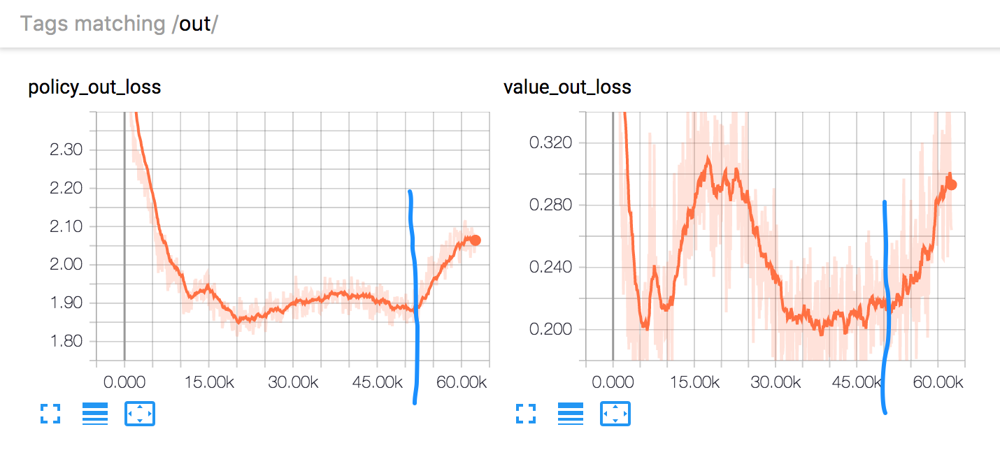
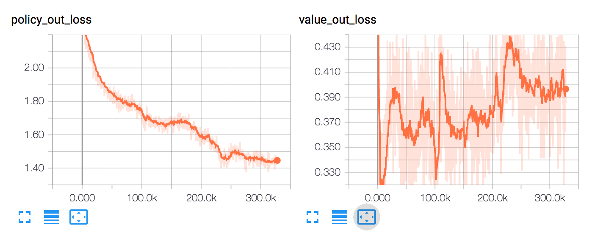

Challenges
===============

About
--------

|-|AlphaGo Zero|AlphaZero|Challenge 1|Challenge 2|Challenge 3|Challenge 4|Challenge 5|
|-----|-----|-----|-----|-----|-----|-----|-----|
|Worker|self, opt, eval|self, opt|self, opt, eval|self, opt|self, opt|self, opt|self, opt|
|use_newest_next_generation_model|FALSE|TRUE|FALSE|TRUE|TRUE|TRUE|TRUE|
|simulation_num_per_move|1600|800|?|400|100|100|8->100->400|
|save_policy_of_tau_1|FALSE(maybe)|FALSE(maybe)|FALSE|TRUE|TRUE|TRUE|TRUE|
|c_puct|5(maybe)|5(maybe)|1~3|1|1|1|1|
|virtual_loss|3(maybe)|3(maybe)|3|3 -> 30|10 -> 3|3|3|
|dirichlet_alpha|　|　|　|0.5|0.5|0.5|0.5|
|max number of games in training data|　|　|200 * 50|2000 * 5 -> 300 * 5|60 * 5 -> 100 * 5|300 * 5|300 * 5|
|change_tau_turn|30|　|10|10|3|3|3|
|dirichlet_noise_only_for_legal_moves|?|?|FALSE|FALSE|TRUE|TRUE|TRUE|
|share_mtcs_info_in_self_play|-|-|FALSE|FALSE|FALSE|TRUE|TRUE|

### Challenge 1
It became strong to a certain extent, but it took time to grow.
We often changed the hyper parameters on the way.

### Challenge 2
It became as strong as GRhino LV3 (maybe). It almost won GRhino LV2 finally.
Changing "max number of games in training data (max_file_num 2000 -> 300)" made improvement faster.
It seems that changing virtual loss from 3 to 30 on the way of training made model collapse some degree.  

### Challenge 3
Trying small simulation_num_per_move and max_file_num.
virtual_loss is a little smaller.
Dirichlet noise to the root node in MCTS is applied only to legal moves.

* 2018/01/12: change max_file_num from 60 to 100, because training data size was less then 100,000.
* 2017/01/12: it seems that too small max_file_num makes large bias training data, and leads to early false positive resign.
* 2017/01/13: give up challenge.

Learning rate is set 0.0001 after 50000 step, it seems too early.

### Challenge 4

Try small simulation_num_per_move(=100).
The model became as strong as NTest LV 2~4 in a week.

### Challenge 5

Trying changing simulation_num_per_move from 8 to 400.
Change batch size from 512 to 256.

Challenge 1(AlphaGo Method)
------------

The following table is records of the best models.
For model performance evaluation,
sometimes I am competing with iOS app(https://itunes.apple.com/ca/app/id574915961) and the best model.
"Won the App LV x" means the model won the level at least once (regardless of the number of losses).

It takes about 2~3 hours to evaluate one model in my environment.
Therefore, if you divide the time taken by 3, you can see the approximate number of evaluation times.

I changed many parameters for try-and-error.

|best model generation|date|winning percentage to best model|Time Spent(hours)|note|
|-----|---|-----|-----|-----|
|1|-|-|-|　|
|2|2017/10/24|94.1%|-|　|
|3|2017/10/24|63.4%|13|　|
|4|2017/10/25|62.0%|3|　|
|5|2017/10/25|56.7%|8|　|
|6|2017/10/25|67.3%|7|　|
|7|2017/10/25|59.0%|3|　|
|8|2017/10/26|59.7%|6|　|
|9|2017/10/26|59.4%|3|　|
|10|2017/10/26|55.7%|5|　|
|11|2017/10/26|57.9%|9|　|
|12|2017/10/27|55.6%|5|　|
|13|2017/10/27|56.5%|7|　|
|14|2017/10/28|58.4%|20|　|
|15|2017/10/28|62.4%|3|　|
|16|2017/10/28|56.0%|11|　|
|17|2017/10/29|64.9%|17|　|
|18|2017/10/30|55.2%|19|　|
|19|2017/10/31|57.2%|33|　|
|20|2017/11/01|55.7%|12|　|
|21|2017/11/01|59.7%|20|　|
|22|2017/11/02|57.8%|19|　|
|23|2017/11/03|55.8%|15|　|
|24|2017/11/03|64.2%|12|　|
|25|2017/11/04|55.4%|21|　|
|26|2017/11/04|56.7%|6|　|
|27|2017/11/05|57.5%|11|　|
|28|2017/11/06|58.5%|15|　|
|29|2017/11/06|55.3%|5|　|
|30|2017/11/06|55.0%|8|　|
|31|2017/11/06|56.9%|5|　|
|32|2017/11/07|56.1%|9|　|
|33|2017/11/08|55.7%|22|　|
|34|2017/11/08|56.1%|3|　|
|35|2017/11/08|59.0%|3|　|
|36|2017/11/08|59.4%|3|　|
|37|2017/11/08|56.2%|9|　|
|38|2017/11/10|55.4%|52|Won the app LV9, LV10|
|39|2017/11/12|57.2%|29|　|
|40|2017/11/12|55.1%|12|Won the app LV11|
|41|2017/11/13|55.7%|14|Won the app LV12, 13, 14, 15, 16, 17. I can't win anymore.|
|42|2017/11/15|57.8%|18|Won the app LV18, 19|
|43|2017/11/15|55.8%|16|　|
|44|2017/11/16|57.5%|8|　|
|45|2017/11/16|56.2%|3|Won the app LV20|
|46|2017/11/18|55.6%|49|　|
|47|2017/11/19|55.9%|34|　|
|48|2017/11/19|59.4%|9|　|
|49|2017/11/20|55.9%|6|　|
|50|2017/11/22|56.0%|44|　|
|51|2017/11/26|55.8%|112|11/25 morning, changed c_puct from 3 to 1.5.|
|52|2017/11/26|59.7%|6|　|
|53|2017/11/28|56.2%|33|Won the app LV21|
|54|2017/11/29|59.0%|24|　|
|55|2017/12/01|56.6%|58|　|
|56|2017/12/03|58.1%|49|self-play: always save policy of tau=1|
|57|2017/12/04|55.1%|24|　|
|58|2017/12/05|55.9%|35|　|
|59|2017/12/06|55.4%|6|　|
|-|2017/12/06|-|-|implement https://github.com/mokemokechicken/reversi-alpha-zero/issues/13|
|60|2017/12/07|61.7%|25|　|
|61|2017/12/07|58.1%|3|Won the app LV21,22|
|62|2017/12/07|57.8%|11|　|
|-|2017/12/07|-|-|fix bug about virtual loss W|
|63|2017/12/08|57.5%|9|　|
|64|2017/12/08|56.0%|9|　|

Challenge 2 (AlphaZero Method)
------------

* use_newest_next_generation_model = True
* simulation_num_per_move = 400
* save_policy_of_tau_1 = True
* c_puct = 1
* save_model_steps = 200

|date|note|
|:---:|---|
|2017/12/15|Won the app LV1|
|2017/12/17|Won the app LV3,5,7,9|
|2017/12/18|Won the app LV11,13|
|2017/12/20|Won the app LV14|
|2017/12/21|Won the app LV15,16,17|
|2017/12/22|Won the app LV18,19,20,21,22,23,24,25|
|2017/12/23|Won the app LV26|
|2017/12/24|Won the app LV27,28|
|2017/12/25|no progress|
|2017/12/26|Lost the app LV29(0-2) (Model won 0, lost 2)|
|2017/12/27|Lost the app LV29(0-2) (Model won 0, lost 2)|
|2017/12/28|Model vs LV29: (2-4) (Model won 2, lost 4), Model vs GRhino LV2: (1-2)|
|2017/12/29|Model vs LV30: (1-2), Model vs GRhino LV2: (0-3)|
|2017/12/30|Model vs LV31: (0-2), Model vs GRhino LV2: (2-2)|
|2017/12/31|Model vs LV31: (0-2)|
|2018/01/04|Change max_file_num from 2000 to 300 (#26)|
|2018/01/05|Model vs LV31: (3-2), Model vs GRhino LV2: (4-1), vs Grhino LV3: (2-1)|
|2018/01/06|(win, lose, draw): vs Grhino LV3 (0, 1, 2)|
|2018/01/08|(win, lose, draw): vs Grhino LV3 (0, 5, 0)|
|2018/01/08|change virtual_loss=30: (win, lose, draw): vs Grhino LV3 (2, 2, 0)|
|2018/01/09|(win, lose, draw): vs Grhino LV3 (1, 2, 0)|
|2018/01/10|(win, lose, draw): vs Grhino LV3 (1, 1, 0), vs App LV33 (1, 1, 0), vs App LV34 ()|
|2018/01/10|change resign_threshold from -0.9 to -0.95|
|2018/01/11|change change_tau_turn from 10 to 3|
|2018/01/11|(win, lose, draw): vs Grhino LV3 (2, 1, 0)|

Challenge 3 (AlphaZero Method)
------------

|date|note|
|:---:|---|
|2018/01/12|start|
|2018/01/13|give up|

Challenge 4 (AlphaZero Method)
------------
* use `simulation_num_per_move = 400` for evaluation
  * use [reversi-arena](https://github.com/mokemokechicken/reversi-arena) for evaluation. raz depth=20.
* (Win, Lose, Draw)
* Vs NBoard Engine.
* NTest Lv2~3 is stronger than the iOS App around LV44~

|date|note|
|:---:|---|
|2018/01/13|start|
|2018/01/14|restart because of critical virtual loss [bug #35](https://github.com/mokemokechicken/reversi-alpha-zero/issues/35)|
|2018/01/14|Ethelred LV4(2, 0, 0), Gertrude LV1(3, 2, 0) LV2(1, 3, 0), share MCTS info in self play|
|2018/01/15|Gertrude LV2(3, 4, 0)|
|2018/01/16|Gertrude LV2(3, 0, 0), change learning rate from 0.001 -> 0.01 at step 107740|
|2018/01/16|Gertrude LV3(4, 0, 0), Gertrude LV4(2, 0, 0), Ivan LV2(2, 0, 0), Ivan LV4(2, 0, 0), Keiko LV4(2, 1, 1), Novello LV1(0, 0, 1)|
|2018/01/17|Novello LV1(2, 0, 0), Ntest LV1(2, 0, 0), Ntest LV2(1, 2, 0)|
|2018/01/18|change learning rate from 0.01 -> 0.001 about step 213000, Ntest LV2(4, 2, 0), LV5(0, 2, 0)|
|2018/01/19|Ntest LV2(2, 2, 0)|
|2018/01/20|Ntest LV1(10, 0, 0), LV2(6, 3, 1), LV3(6, 4, 0), LV4(2, 8, 0)|

Challenge 5 (AlphaZero Method)
------------
* RAZ: this model (Reversi Alpha Zero)
* "RAZ:10" means "RAZ depth 10". depth N means sim_per_move=N*20 

I usually evaluate with RAZ:20.

|date|note|
|:---:|---|
|2018/01/20|start|
|2018/01/21|Ethelred LV4(2, 0, 0), Gertrude LV2(2, 0, 0), LV4(1, 1, 0), Ntest LV1(1, 19, 0), self-play didn't run about 12 hours|
|2018/01/22|Ntest LV1(9, 30, 1)|
|2018/01/23|Ntest LV1(12, 16, 2)|
|2018/01/24|Ntest LV1(13, 6, 1), (evening) RAZ:10 vs Ntest LV1 (8, 2, 0) and Ntest LV2 (3, 7, 0). Small depth didn't bring weakness to ntest-lv1~2.|
|2018/01/25|Ntest LV1(16, 3, 1), LV2(6, 4, 0), LV3(8, 12, 0), LV4(1, 9, 0), LV5(2, 17, 1), change lr from 0.001 to 0.0001 around 540k steps|
|2018/01/26|Ntest LV1(18, 2, 0), LV3(9, 9, 2), LV5(0, 20, 0)|
|2018/01/27|Ntest LV1(17, 1, 2), LV3(4, 15, 1), LV5(1, 18, 1)|
|2018/01/28|Ntest LV1(8, 2, 0), LV3(2, 8, 0), LV5(2, 8, 0), change lr from 0.0001 to 0.001 around 800k steps, to 0.0005 around 820k steps|
