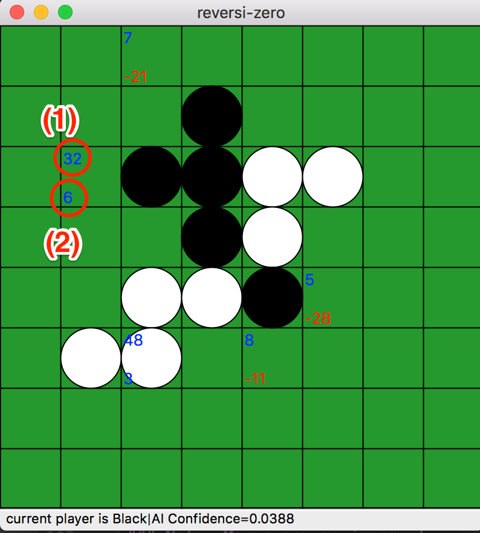
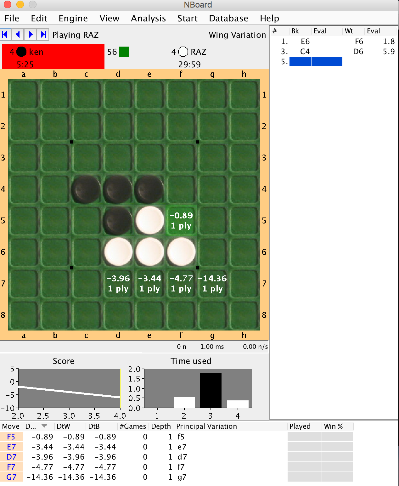
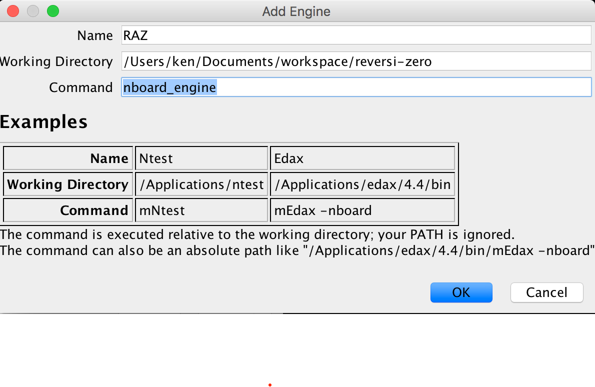
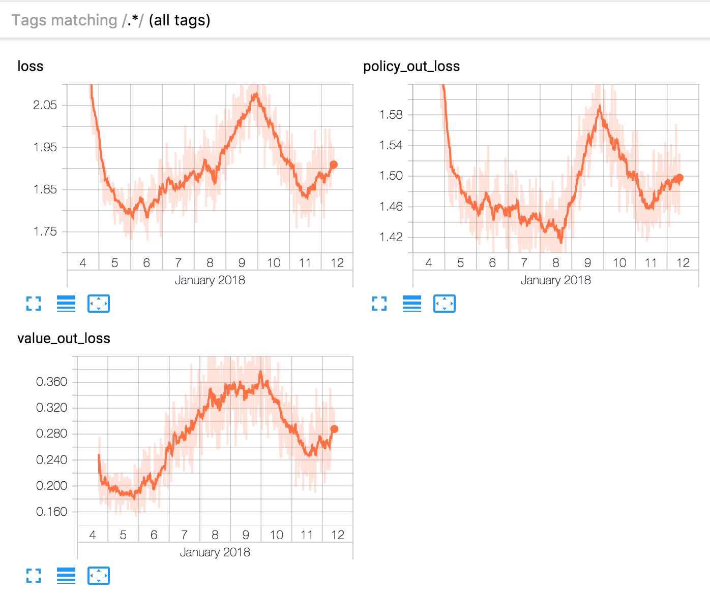

About
=====

Reversi reinforcement learning by [AlphaGo Zero](https://deepmind.com/blog/alphago-zero-learning-scratch/) methods.

@mokemokechicken's training hisotry is [Challenge History](challenge_history.md).

If you can share your achievements, I would be grateful if you post them to [Performance Reports](https://github.com/mokemokechicken/reversi-alpha-zero/issues/40).

Environment
-----------

* Python 3.6.3
* tensorflow-gpu: 1.3.0 (+)
  * tensorflow==1.3.0 is also ok, but very slow. When `play_gui`, tensorflow(cpu) is enough speed.
* Keras: 2.0.8 (+)

Modules
-------

### Reinforcement Learning

This AlphaGo Zero implementation consists of three worker `self`, `opt` and `eval`.

* `self` is Self-Play to generate training data by self-play using BestModel.
* `opt` is Trainer to train model, and generate next-generation models.
* `eval` is Evaluator to evaluate whether the next-generation model is better than BestModel. If better, replace BestModel.
  * If `config.play.use_newest_next_generation_model = True`, this worker is useless. (It is AlphaZero method)

### Evaluation

For evaluation, you can play reversi with the BestModel.  

* `play_gui` is Play Game vs BestModel using wxPython.

Data
-----

* `data/model/model_best_*`: BestModel.
* `data/model/next_generation/*`: next-generation models.
* `data/play_data/play_*.json`: generated training data.
* `logs/main.log`: log file.

If you want to train the model from the beginning, delete the above directories.

How to use
==========

Setup
-------
### install libraries
```bash
pip install -r requirements.txt
```

### install libraries with Anaconda
```bash
cp requirements.txt conda-requirements.txt
```
* Comment out lines for `jedi`, `Keras`, `parso`, `python-dotenv`, `tensorflow-tensorboard`, `wxPython` libraries
* Replace '-' with '_' for  `ipython-genutils`, `jupyter-*`, `prompt-toolkit` libraries
```bash
conda env create -f environment.yml
source activate reversi-a0
conda install --yes --file conda-requirements.txt
```

If you want use GPU,

```bash
pip install tensorflow-gpu
```

### set environment variables
Create `.env` file and write this.

```text:.env
KERAS_BACKEND=tensorflow
```

Strongest Model
---------------
Now, "challenge 5 model" and "ch5 config" are strongest in my models.
If you want to play with it,

```bash
rm -rf data/model/next_generation/
sh ./download_model.sh 5
# run as wxPython GUI
python src/reversi_zero/run.py play_gui -c config/ch5.yml
```

If you want to use as a NBoard engine(see below "Run as NBoard2.0 Engine"), please use `nboard_engine -c config/ch5.yml` for the Command. 

Past Models
------------
Please remove( or rename) `data/model/next_generation/` directory if you want to use "BestModel" at `data/model/model_best_*`.

### Download Trained BestModel

Download trained BestModel(trained by bellow Challenge 1) for example.

```bash
sh ./download_best_model.sh
```

### Download Trained the Newest Model

Download trained the newest model(trained by Challenge 2, 3, 4, 5) as BestModel.

```bash
sh ./download_model.sh <version>
```

ex)

```bash
sh ./download_model.sh 5
```

Configuration
--------------

### 'AlphaGo Zero' method and 'AlphaZero' method

I think the main difference between 'AlphaGo Zero' and 'AlphaZero' is whether using `eval` or not.
It is able to change these methods by configuration.

#### AlphaGo Zero method

* `PlayConfig#use_newest_next_generation_model = False`
* `PlayWithHumanConfig#use_newest_next_generation_model = False`
* Execute `Evaluator` to select the best model.

#### AlphaZero method

* `PlayConfig#use_newest_next_generation_model = True`
* `PlayWithHumanConfig#use_newest_next_generation_model = True`
* Not use `Evaluator` (the newest model is selected as `self-play`'s model)

### policy distribution of self-play

In DeepMind's paper,
it seems that policy(π) data saved by self-play are distribution in proportion to pow(N, 1/tau).
After the middle of the game, the tau becomes 0, so the distribution is one-hot.

`PlayDataConfig#save_policy_of_tau_1 = True` means that the saved policy's tau is always 1.

## other important hyper-parameters (I think)

If you find a good parameter set, please share in the github issues!

### PlayDataConfig

* `nb_game_in_file,max_file_num`: The max game number of training data is `nb_game_in_file * max_file_num`.
* `multi_process_num`: Number of process to generate self-play data.

### PlayConfig, PlayWithHumanConfig

* `simulation_num_per_move` : MCTS number per move.
* `c_puct`: balance parameter of value network and policy network in MCTS.
* `resign_threshold`: resign threshold
* `parallel_search_num`: balance parameter(?) of speed and accuracy in MCTS.
  * `prediction_queue_size` should be same or greater than `parallel_search_num`.
* `dirichlet_alpha`: random parameter in self-play.
* `share_mtcs_info_in_self_play`: extra option. if true, share MCTS tree node information among games in self-play.
  * `reset_mtcs_info_per_game`: reset timing of shared MCTS information.
* `use_solver_turn`, `use_solver_turn_in_simulation`: use solver from this turn. not use it if `None`.   

### TrainerConfig

* `wait_after_save_model_ratio`: if greater than 0, optimizer will wait the ratio time to time span of saving model every after saving model. It might be useful if you run `self-play` and `optimize` in one GPU. 

Basic Usages
------------

For training model, execute `Self-Play`, `Trainer` and `Evaluator`.


Self-Play
--------

```bash
python src/reversi_zero/run.py self
```

When executed, Self-Play will start using BestModel.
If the BestModel does not exist, new random model will be created and become BestModel.

### options
* `--new`: create new BestModel
* `-c config_yaml`: specify config yaml path override default settings of `config.py`

Trainer
-------

```bash
python src/reversi_zero/run.py opt
```

When executed, Training will start.
A base model will be loaded from latest saved next-generation model. If not existed, BestModel is used.
Trained model will be saved every 2000 steps(mini-batch) after epoch.

### options
* `-c config_yaml`: specify config yaml path override default settings of `config.py`
* `--total-step`: specify total step(mini-batch) numbers. The total step affects learning rate of training.

Evaluator
---------

```bash
python src/reversi_zero/run.py eval
```

When executed, Evaluation will start.
It evaluates BestModel and the latest next-generation model by playing about 200 games.
If next-generation model wins, it becomes BestModel.

### options
* `-c config_yaml`: specify config yaml path override default settings of `config.py`

Play Game
---------

```bash
python src/reversi_zero/run.py play_gui
```

### Note: Mac pyenv environment

`play_gui` uses `wxPython`.
It can not execute if your python environment is built without Framework.
Try following pyenv install option.

```bash
env PYTHON_CONFIGURE_OPTS="--enable-framework" pyenv install 3.6.3
```

For Anaconda users:
```bash
conda install python.app
pythonw src/reversi_zero/run.py play_gui
```




When executed, ordinary reversi board will be displayed and you can play against BestModel.
After BestModel moves, numbers are displayed on the board.

* Top left numbers(1) mean 'Visit Count (=N(s,a))' of the last search.
* Bottom left numbers(2) mean 'Q Value (=Q(s,a)) on AI side' of the last state and move. The Q values are multiplied by 100.

Run as NBoard2.0 Engine
--------------

[NBoard](http://www.orbanova.com/nboard/) is a very good reversi GUI and has strong reversi engines,
which runs on Windows, Mac, and Linux (JRE required).



It can add external engines that implement [NBoard Protocol](https://github.com/weltyc/ntest/blob/master/instructions/Protocol.htm).

### How to add this model as an external engine to NBoard

* (0) launch NBoard from command line(need environment variables like PATH)
  * ex) `java -jar /Applications/NBoard/nboard-2.0.jar`
* (1) select menu `Engine -> Select Opponent...`
* (2) clike button `Add Engine`
* (3) set parameter:
  * `Name` = `RAZ` (for example)
  * `Working Directory` = PATH TO THIS PROJECT
  * `Command` = `nboard_engine` or `bash nboard_engine`. If you want to specify config type, `nboard_engine -c config/ch5.yml`.
  
* (4) Engine Level N is set as `simulation_num_per_move=N*20`



### convenient way to evaluate your model

NBoard cannot play with two different engines (maybe).
However, it can select different engines of play-engine and analysis-engine.

So, convenient way to evaluate your model is for example,

* select this engine as play-engine (or analysis-engine), another engine as analysis-engine (or play-engine).
* check menu `View -> Highlight Best Move`
* start `User plays Black`(or White)
* You simply choose the best move of analysis-engine.

I have little confidence about `hint` protocol as analysis-engine (there is odd behavior),
but work in my environment.

Auto Evaluation with other reversi AIs
----------------

[reversi-arena](https://github.com/mokemokechicken/reversi-arena) is a system for evaluating reversi AIs which implement NBoard Protocol.
It is useful when playing many games with strong AI like NTest.


View Training Log in TensorBoard
----------------

### 1. install tensorboard

```bash
pip install tensorboard
```

### 2. launch tensorboard and access by web browser

```bash
tensorboard --logdir logs/tensorboard/
```

And access `http://<The Machine IP>:6006/`.



### Trouble Shooting

If you can not launch tensorboard by error,
try to create another new plain project which includes only `tensorflow` and `tensorboard`.

And

```bash
tensorboard --logdir <PATH TO REVERSI DIR>/logs/tensorboard/
```


Tips and Memo
====

GPU Memory
----------

In my environment of GeForce GTX 1080, memory is about 8GB, so sometimes lack of memory happen.
Usually the lack of memory cause warnings, not error.
If error happens, try to change `per_process_gpu_memory_fraction` in `src/worker/{evaluate.py,optimize.py,self_play.py}`,

```python
tf_util.set_session_config(per_process_gpu_memory_fraction=0.2)
```

Less batch_size will reduce memory usage of `opt`.
Try to change `TrainerConfig#batch_size` in `NormalConfig`.

Training Speed
------

* CPU: 8 core i7-7700K CPU @ 4.20GHz
* GPU: GeForce GTX 1080
* 1 game in Self-Play: about 10~20 sec (simulation_num_per_move = 100, thinking_loop = 1).
* 1 step(mini-batch, batch size=512) in Training: about 1.8 sec.
